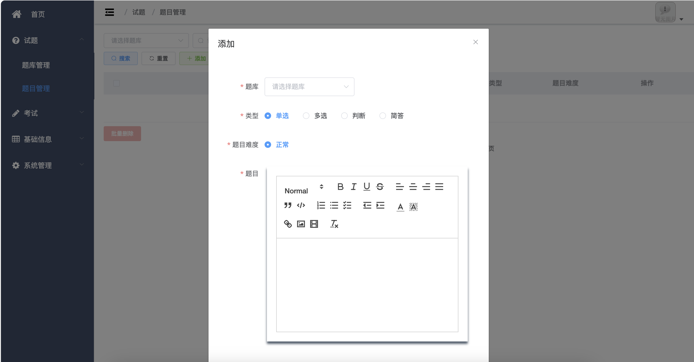
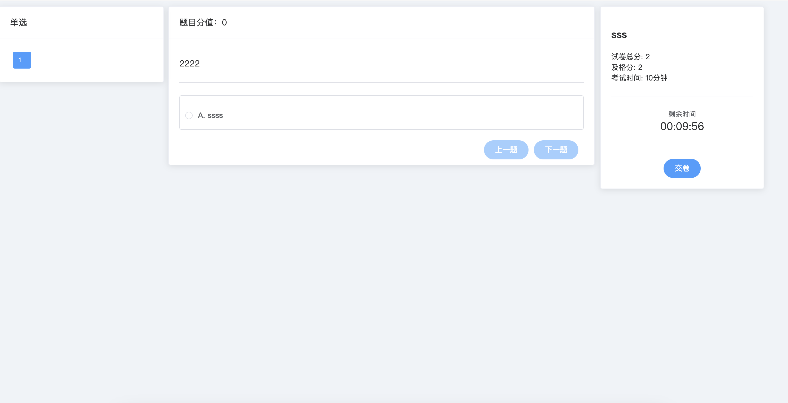
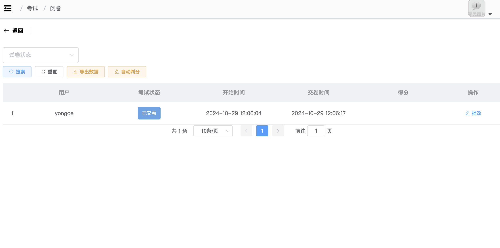

## springboot3-考试系统

## 技术

前端技术栈 ES6、vue2、vuex、vue-router、vue-cli、axios、element-ui  
后端技术栈 SpringBoot3、MyBatisPlus、MySQL、Redis、Jwt  

## 前端运行

npm install --registry=https://registry.npmmirror.com  
npm i  
npm run serve  
或者安装pnpm   
pnpm config set registry https://registry.npmmirror.com  
pnpm i  
pnpm serve

## 后端运行

1. 导入数据脚本`exam-mysql8.sql`
2. 打开IDEA运行`Application.java`。

## 图片

